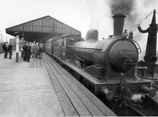

# Ejercicio - Trenes

Una administradora ferroviaria necesita una aplicación que le ayude a manejar las
formaciones que tiene disponibles en distintos depósitos.

Una formación es lo que habitualmente llamamos “un tren”, tiene una o varias locomotoras,
y uno o varios vagones. Hay vagones de pasajeros y vagones de carga.

En cada depósito hay: formaciones ya armadas, y locomotoras sueltas que pueden ser
agregadas a una formación.

De cada vagón de pasajeros se conoce el largo en metros, y el ancho útil también en
metros.
La cantidad de pasajeros que puede transportar un vagón de pasajeros es:
    - Si el ancho útil es de hasta 2.5 metros: metros de largo * 8.
    - Si el ancho útil es de más de 2.5 metros: metros de largo * 10.

P.ej., si tenemos dos vagones de pasajeros, los dos de 10 metros de largo, uno de 2 metros
de ancho útil, y otro de 3 metros de ancho útil, entonces el primero puede llevar 80
pasajeros, y el segundo puede llevar 100.
Un vagón de pasajeros no puede llevar carga.

De cada vagón de carga se conoce la carga máxima que puede llevar, en kilos. Un vagón
de carga no puede llevar ningún pasajero. No hay vagones mixtos.

El peso máximo de un vagón, medido en kilos, se calcula así:
    - Para un vagón de pasajeros: cantidad de pasajeros que puede llevar * 80.
    - Para un vagón de carga: la carga máxima que puede llevar + 160 (en cada vagón de
carga van dos guardas).

De cada locomotora se sabe: su peso, el peso máximo que puede arrastrar, y su velocidad
máxima. P.ej. puedo tener una locomotora que pesa 1000 kg, puede arrastrar hasta 12000
kg, y su velocidad máxima es de 80 km/h. Obviamente se tiene que arrastrar a ella misma,
entonces no le puedo cargar 12000 kg de vagones, solamente 11000; diremos que este es
su “arrastre útil”.

Modelar la situación descripta de acuerdo al paradigma de objetos para poder saber:
El total de pasajeros que puede transportar una formación.

1.  Cuántos vagones livianos tiene una formación; un vagón es liviano si su peso
    máximo es menor a 2500 kg

2.  La velocidad máxima de una formación, que es el mínimo entre las velocidades
    máximas de las locomotoras.

3.  Si una formación es eficiente; es eficiente si cada una de sus locomotoras arrastra,
    al menos, 5 veces su peso (el de la locomotora misma).

4.  Si una formación puede moverse. Una formación puede moverse si el arrastre útil
    total de sus locomotoras es mayor o igual al peso máximo total de los vagones.

5.  Cuántos kilos de empuje le faltan a una formación para poder moverse, que es: 0 si
    ya se puede mover, y (peso máximo total de los vagones – arrastre útil total de las
    locomotoras) en caso contrario.

6.  Dado un depósito, obtener el conjunto formado por el vagón más pesado de cada
    formación; se espera un conjunto de vagones.

7.  Si un depósito necesita un conductor experimentado. Un depósito necesita un
    conductor experimentado si alguna de sus formaciones es compleja. Una formación es
    compleja si: tiene más de 20 unidades (sumando locomotoras y vagones), o el peso
    total (sumando locomotoras y vagones) es de más de 10000 kg.

8.  Agregar, dentro de un depósito, una locomotora a una formación determinada, de
    forma tal que la formación pueda moverse. Si la formación ya puede moverse,
    entonces no se hace nada. Si no, se le agrega una locomotora suelta del depósito
    cuyo arrastre útil sea mayor o igual a los kilos de empuje que le faltan a la formación.
    Si no hay ninguna locomotora suelta que cumpla esta condición, no se hace nada.

Indicar qué clases se necesitan, qué variables de instancia se necesitan en cada clase, qué
mensajes van a entender las instancias de cada clase, y escribir los métodos
correspondientes.

Para cada punto, indicar a qué objeto se le pide lo que se indica, con qué mensaje, qué
parámetros, y qué devuelve.

Para el punto 7, indicar en qué otros objetos delega el responsable de hacer lo que se pide,
y qué delega. Si hay una cadena de delegaciones (al objeto 1 le piden algo,
entonces delega algo en el objeto 2, y el objeto 2 para hacer lo que le pidió el 1 tiene que
delegar otra cosa en otro objeto 3) indicarla.

